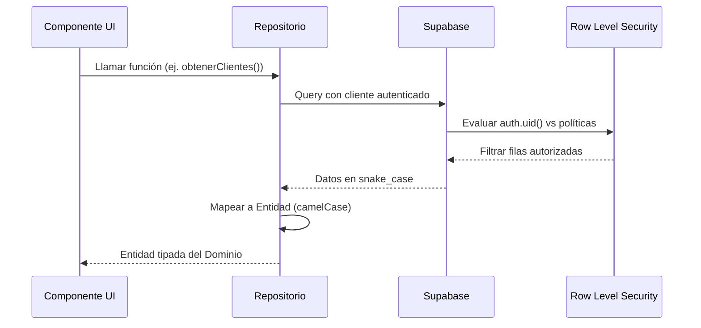

# CRM Legal — Iturri & Asociados
## Documentación de Arquitectura (Clean Architecture)

**Versión:** 2.0 — Post-Refactorización  
**Fecha:** Abril 2026  
**Destinatarios:** CEO / CPO / Equipo Técnico

---

## 1. Visión General

El CRM Legal de Iturri & Asociados es una aplicación web construida con **Next.js 16 (App Router)** y **Supabase** como backend. La arquitectura sigue los principios de **Clean Architecture**, separando estrictamente las responsabilidades en tres capas independientes.

```
┌─────────────────────────────────────────────────────┐
│                   PRESENTACIÓN                      │
│              app/ + components/                     │
│     (React, Next.js App Router, UI "tonta")         │
├─────────────────────────────────────────────────────┤
│                     DOMINIO                         │
│                    domain/                          │
│    (Entidades, Tipos, Servicios puros — SIN         │
│     dependencia de Supabase ni React)               │
├─────────────────────────────────────────────────────┤
│                 INFRAESTRUCTURA                     │
│               infrastructure/                       │
│   (Repositorios Supabase, Server Actions,           │
│    Clientes de BD — toda la lógica de datos)        │
└─────────────────────────────────────────────────────┘
```

**Regla de Oro**: Las flechas de dependencia SIEMPRE apuntan hacia adentro. La Presentación depende del Dominio. La Infraestructura implementa contratos del Dominio. **Ningún componente de UI importa Supabase directamente.**

---

## 2. Estructura de Directorios

```
crm-legal-frontend/
├── app/                          # Capa de Presentación (Next.js App Router)
│   ├── dashboard/
│   │   ├── layout.tsx            # Layout principal del dashboard
│   │   ├── page.tsx              # Dashboard por rol (Admin/Abogado/Cliente)
│   │   ├── clientes/             # CRUD de clientes
│   │   ├── casos/                # Gestión de expedientes legales
│   │   │   └── [id]/             # Detalle con tabs: Info, Docs, Bitácora, Finanzas, Plantillas
│   │   ├── agenda/               # Agenda legal con eventos
│   │   ├── equipo/               # Directorio del equipo legal
│   │   ├── finanzas/             # Panel financiero global
│   │   ├── reportes/             # BI Analytics (solo admin)
│   │   ├── plantillas/           # Gestión de plantillas de documentos
│   │   ├── configuracion/        # Parámetros administrativos globales
│   │   └── auditoria/            # Log de auditoría del sistema
│   ├── login/                    # Página de autenticación
│   └── page.tsx                  # Redirect automático → /dashboard
│
├── components/                   # Componentes atómicos reutilizables
│   ├── ui/                       # Primitivos: Button, FormField, SelectField, Alert, Toast
│   ├── BotonSalir.tsx            # Cierre de sesión (usa authRepository)
│   ├── PerfilUsuario.tsx         # Avatar + rol (usa authRepository)
│   ├── plantillas/               # Componentes de plantillas
│   └── reportes/                 # Componentes de reportes
│
├── domain/                       # Capa de Dominio (pura, sin dependencias externas)
│   ├── entities/                 # Entidades de negocio (TypeScript interfaces)
│   │   ├── Cliente.ts
│   │   ├── Expediente.ts
│   │   ├── EntradaBitacora.ts
│   │   ├── Documento.ts
│   │   ├── EventoAgenda.ts
│   │   ├── MiembroEquipo.ts
│   │   ├── Plantilla.ts
│   │   ├── Finanzas.ts
│   │   ├── AuditoriaLog.ts
│   │   ├── ConfiguracionGlobal.ts
│   │   ├── Reportes.ts
│   │   └── UsuarioPerfil.ts
│   ├── types/                    # Tipos compartidos
│   │   └── RepositoryResponse.ts # Contrato genérico de respuesta
│   └── services/                 # Lógica de negocio pura
│       └── documentGenerator.ts  # Motor de plantillas (regex-based)
│
├── infrastructure/               # Capa de Infraestructura
│   ├── supabase/                 # Clientes Supabase (client + server + middleware)
│   │   ├── client.ts             # Cliente browser (RLS del usuario autenticado)
│   │   ├── server.ts             # Cliente server-side (cookies SSR)
│   │   └── middleware.ts         # Refresh automático de sesiones
│   ├── repositories/             # Repositorios de datos (toda la lógica Supabase)
│   │   ├── authRepository.ts     # Autenticación: login, registro, logout, sesión
│   │   ├── clienteRepository.ts
│   │   ├── expedienteRepository.ts
│   │   ├── bitacoraRepository.ts
│   │   ├── documentoRepository.ts
│   │   ├── agendaRepository.ts
│   │   ├── equipoRepository.ts
│   │   ├── finanzasRepository.ts
│   │   ├── plantillasRepository.ts
│   │   ├── reportesRepository.ts
│   │   ├── auditoriaRepository.ts
│   │   ├── configuracionRepository.ts
│   │   └── usuarioRepository.ts
│   └── actions/                  # Server Actions de Next.js
│       ├── plantillasActions.ts  # CRUD + generación de documentos
│       └── equipoActions.ts      # Registro de miembros (Admin API)
│
└── middleware.ts                 # Protección de rutas (auth guard global)
```

---

## 3. Flujo de Datos Seguro



### Principios de Seguridad

| Capa | Mecanismo | Descripción |
|------|-----------|-------------|
| **Base de Datos** | RLS (Row Level Security) | Cada consulta se ejecuta bajo `auth.uid()`. Los clientes solo ven sus expedientes; los abogados solo sus asignaciones. |
| **Middleware** | `middleware.ts` | Intercepta todas las rutas `/dashboard/*` y redirige a `/login` si no hay sesión válida. |
| **Server Actions** | `'use server'` | Operaciones sensibles (CRUD plantillas, registro de equipo) se ejecutan en el servidor. |
| **RBAC Aplicativo** | Validación en repositorios | El módulo de reportes verifica `rol === 'admin'` antes de entregar datos financieros. |
| **Admin API** | `service_role` key | Solo usada en Server Actions para crear usuarios auth (registro de equipo). Nunca expuesta al cliente. |

---

## 4. Gobernanza de Imports

### Regla Absoluta

Todos los imports del proyecto utilizan el alias `@/` definido en `tsconfig.json`, apuntando a la raíz del proyecto. Esto elimina la fragilidad de rutas relativas (`../../..`) y facilita la refactorización.

```typescript
// ✅ CORRECTO — Import absoluto
import { obtenerClientes } from "@/infrastructure/repositories/clienteRepository";
import { Cliente } from "@/domain/entities/Cliente";
import { Button } from "@/components/ui/Button";

// ❌ PROHIBIDO — Import relativo cruzando capas
import { obtenerClientes } from "../../../infrastructure/repositories/clienteRepository";
```

### Regla de la UI "Tonta"

```typescript
// ❌ VIOLACIÓN — Componente UI importando Supabase
import { createClient } from "@/infrastructure/supabase/client";
const supabase = createClient();
const { data } = await supabase.from('clientes').select('*');

// ✅ CORRECTO — Componente UI delegando al repositorio
import { obtenerClientes } from "@/infrastructure/repositories/clienteRepository";
const clientes = await obtenerClientes();
```

---

## 5. Mapa de Módulos y Responsabilidades

| Módulo | Ruta UI | Repositorio | Entidad del Dominio |
|--------|---------|-------------|---------------------|
| Autenticación | `/login` | `authRepository` | — |
| Dashboard | `/dashboard` | `usuarioRepository` | `UsuarioPerfil` |
| Clientes | `/dashboard/clientes` | `clienteRepository` | `Cliente` |
| Expedientes | `/dashboard/casos` | `expedienteRepository` | `Expediente` |
| Bitácora | Tab en `/dashboard/casos/[id]` | `bitacoraRepository` | `EntradaBitacora` |
| Documentos | Tab en `/dashboard/casos/[id]` | `documentoRepository` | `Documento` |
| Finanzas (Caso) | Tab en `/dashboard/casos/[id]` | `finanzasRepository` | `Finanzas` |
| Finanzas (Global) | `/dashboard/finanzas` | `finanzasRepository` | `Finanzas` |
| Plantillas | `/dashboard/plantillas` | `plantillasRepository` | `Plantilla` |
| Agenda | `/dashboard/agenda` | `agendaRepository` | `EventoAgenda` |
| Equipo | `/dashboard/equipo` | `equipoRepository` | `MiembroEquipo` |
| Reportes (BI) | `/dashboard/reportes` | `reportesRepository` | `Reportes` |
| Configuración | `/dashboard/configuracion` | `configuracionRepository` | `ConfiguracionGlobal` |
| Auditoría | `/dashboard/auditoria` | `auditoriaRepository` | `AuditoriaLog` |

---

## 6. Decisiones Arquitectónicas Clave

### 6.1 ¿Por qué Clean Architecture?
- **Mantenibilidad**: Cambiar de Supabase a otra BD requiere modificar SOLO los repositorios, no la UI.
- **Testabilidad**: Los repositorios pueden ser mockeados fácilmente para pruebas unitarias.
- **Escalabilidad**: Nuevos módulos se agregan creando: Entidad → Repositorio → Página.

### 6.2 ¿Por qué Server Actions?
- Las operaciones que requieren `service_role` (clave admin) o lógica sensible se ejecutan exclusivamente en el servidor.
- Evita exponer claves de administración al bundle del cliente.

### 6.3 ¿Por qué `RepositoryResponse<T>`?
- Contrato genérico (`{ data, error }`) que estandariza la comunicación entre capas.
- Permite manejar errores de forma consistente en toda la aplicación.

---

## 7. Guía para Nuevos Desarrolladores

### Agregar un Nuevo Módulo

1. **Crear la Entidad** en `domain/entities/NuevoModulo.ts`
2. **Crear el Repositorio** en `infrastructure/repositories/nuevoModuloRepository.ts`
   - Importar `createClient` desde `@/infrastructure/supabase/client` (o `server`)
   - Mapear datos `snake_case` → `camelCase`
3. **Crear la Página** en `app/dashboard/nuevo-modulo/page.tsx`
   - Importar SOLO del repositorio, NUNCA de Supabase
4. **Verificar** que `npm run build` compila sin errores

### Checklist de Calidad

- [ ] ¿La UI importa Supabase? → **Rechazar PR**
- [ ] ¿Hay rutas relativas cruzando capas? → **Convertir a `@/`**
- [ ] ¿Los tipos del dominio están en `domain/entities/`? → **Verificar**
- [ ] ¿`npm run build` compila sin errores? → **Obligatorio**
- [ ] ¿Se manejan estados Loading, Error, Empty? → **Verificar**

---

*Documento generado automáticamente por Antigravity — Auditoría Clean Architecture, Abril 2026.*
